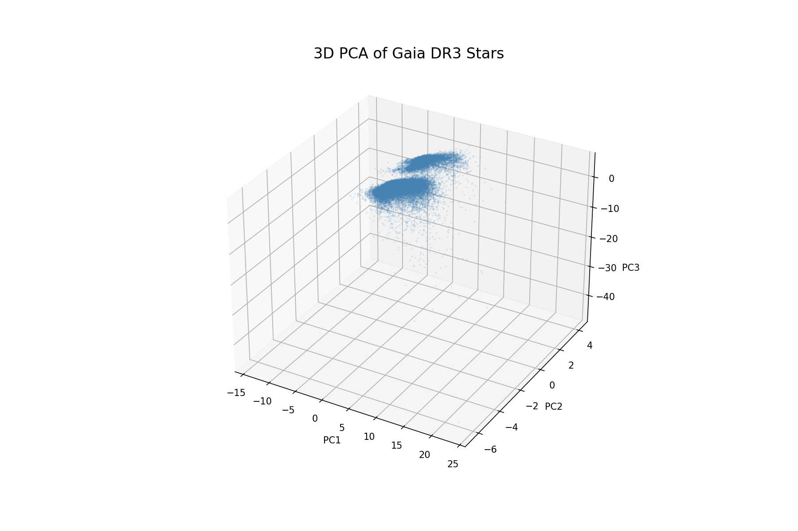
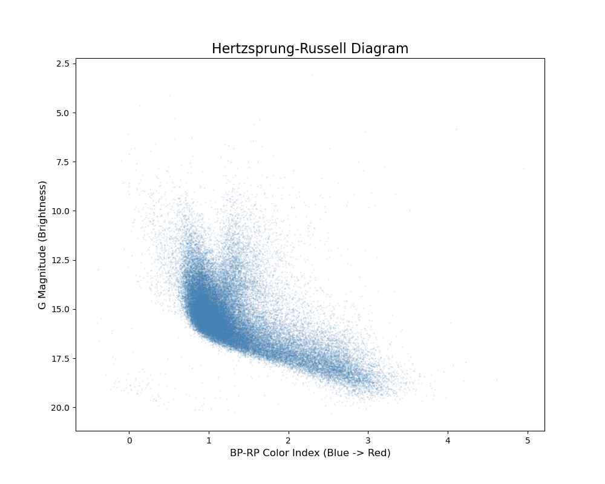
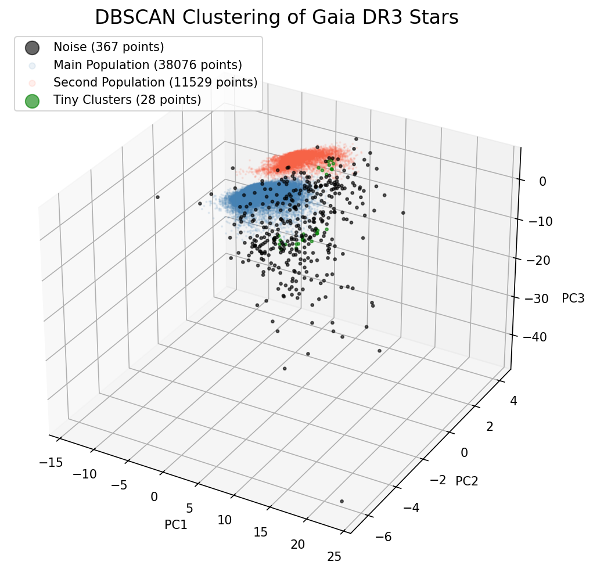
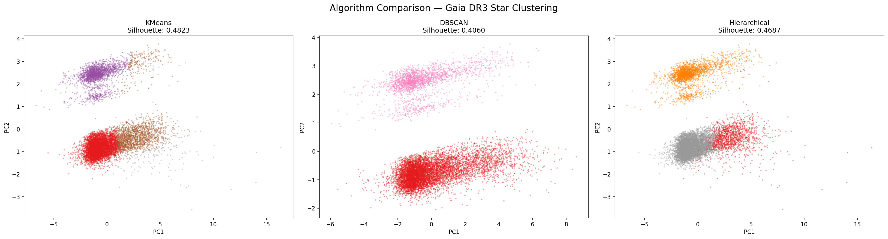

# Stellar Population Discovery — Unsupervised Learning on Gaia DR3


## Overview

An unsupervised machine learning project to discover and analyze stellar
populations from the Gaia DR3 dataset — one of the most comprehensive
stellar catalogs ever produced by the European Space Agency.

Using dimensionality reduction and clustering algorithms, this project
identifies distinct groups of stars based on their physical properties,
without any prior labels.

---

## Dataset

- **Source:** Gaia Data Release 3 (DR3)
- **Query Tool:** astroquery (ESA Gaia Archive)
- **Stars Fetched:** 50,000
- **Features Used:** ra, dec, parallax, parallax_error, pmra, pmdec,
  phot_g_mean_mag, bp_rp, teff_gspphot
- **Query Filters Applied:**
  - parallax > 0 (valid distance measurements only)
  - parallax_error / parallax < 0.1 (high quality measurements)
  - phot_g_mean_mag and bp_rp not null

---

## Project Structure

```
Stellar Population/
├── data/
│   ├── gaia_raw.csv
│   ├── gaia_cleaned.csv
│   ├── gaia_pca.csv
│   ├── gaia_kmeans.csv
│   ├── gaia_dbscan.csv
│   └── gaia_hierarchical.csv
├── images/
│   ├── feature_distributions.png
│   ├── hr_diagram.png
│   ├── proper_motion.png
│   ├── pca_variance.png
│   ├── pca_3d.png
│   ├── kmeans_elbow.png
│   ├── kmeans_clusters.png
│   ├── dbscan_epsilon.png
│   ├── dbscan_clusters.png
│   ├── dendrogram.png
│   └── final_comparison.png
├── notebooks/
│   ├── 01_fetch_data.ipynb
│   ├── 02_eda.ipynb
│   ├── 03_preprocessing.ipynb
│   ├── 04_visualization.ipynb
│   ├── 05_pca.ipynb
│   ├── 06_kmeans.ipynb
│   ├── 07_dbscan.ipynb
│   ├── 08_hierarchical.ipynb
│   └── 09_comparison.ipynb
├── README.md
└── requirements.txt
```

---

## Approach

### 1. Data Fetching — `01_fetch_data.ipynb`
- Queried Gaia DR3 archive using astroquery with quality filters
- Fetched 50,000 stars with 11 features
- Saved as `gaia_raw.csv`

### 2. Exploratory Data Analysis — `02_eda.ipynb`
- Inspected shape, column names, null values, and basic statistics
- Identified missing values in `radial_velocity` (34,505) and
  `teff_gspphot` (4,102)

### 3. Preprocessing — `03_preprocessing.ipynb`
- Dropped `SOURCE_ID` (identifier, not a feature) and `radial_velocity`
  (69% missing values)
- Filled missing `teff_gspphot` values with median
- Final cleaned dataset: 50,000 stars × 9 features
- Saved as `gaia_cleaned.csv`

### 4. Visualization — `04_visualization.ipynb`
- Feature distribution histograms
- Hertzsprung-Russell (HR) Diagram — bp_rp color index vs G magnitude
- Stellar Proper Motion plot colored by surface temperature

### 5. Dimensionality Reduction (PCA) — `05_pca.ipynb`
- Applied `StandardScaler` before PCA
- Tested 3 PCA components → 75.88% variance retained
- Upgraded to **4 PCA components → 83.87% variance retained**
- **3 components used for 3D visualization** — human eyes can only
  perceive 3 dimensions
- **4 components used for all clustering algorithms** — better feature
  representation and consistency

> **Note on PCA Strategy:** 3 PCA components (75% variance) were tested
> as baseline. 4 components (84% variance) were selected for final
> clustering for better variance coverage and consistency across all
> algorithms. Silhouette scores slightly reduced after adding PC4
> (7.99% variance) — expected behavior as extra dimensions stretch
> pairwise distances. 4 components were retained for consistency.

---

## Clustering Algorithms

### KMeans — `06_kmeans.ipynb`
- Used Elbow Method and Silhouette Score to find optimal K
- Applied on all 4 PCA components
- Identified 4 cluster groups in the stellar data

### DBSCAN — `07_dbscan.ipynb`
- Used K-Distance Graph to find optimal epsilon
- `eps=1.2`, `min_samples=5` selected after tuning
- Applied on all 4 PCA components
- Uniquely capable of identifying anomalous/noise stars

### Agglomerative Hierarchical — `08_hierarchical.ipynb`
- Used Dendrogram (1,000 star sample) to visualize cluster hierarchy
- Applied on 10,000 star sample due to O(n²) time complexity
- Used Ward linkage with 3 clusters
- Applied on all 4 PCA components

---

## Results

### Silhouette Scores

All three algorithms achieve scores above **0.40**, indicating good
cluster separation in 4-dimensional PCA space.

| Algorithm    | Silhouette Score |
|--------------|-----------------|
| KMeans       | 0.4823          |
| DBSCAN       | 0.4060          |
| Hierarchical | 0.4687          |

- **KMeans** performs best due to its centroid-based nature suiting the
  spherical cluster structure visible in PCA space
- **DBSCAN** scores lowest but uniquely identifies **367 anomalous
  stars** — a capability KMeans and Hierarchical lack
- **Hierarchical** confirms cluster structure through a completely
  different tree-based approach

### Key Findings
- Two distinct stellar populations discovered consistently across all
  three algorithms
- 367 anomalous stars identified by DBSCAN — potential outliers or
  rare stellar objects
- Cluster separation clearly visible in 3D PCA space

---

## Visualizations

### 3D PCA — Stellar Distribution


### Hertzsprung-Russell Diagram


### DBSCAN Clustering


### Algorithm Comparison


---

## Tech Stack

| Library | Usage |
|-------------|---------------------------------------|
| astroquery | Fetching Gaia DR3 data |
| pandas | Data manipulation |
| numpy | Numerical operations |
| matplotlib | Visualizations |
| scikit-learn | PCA, KMeans, DBSCAN, Agglomerative, Silhouette Score |
| scipy | Dendrogram, Linkage |

---

## Installation

```bash
git clone https://github.com/parthshelar-dev/stellar-population
cd stellar-population
pip install -r requirements.txt
```

---

## Future Improvements
- Interactive Plotly dashboard for cluster visualization
- t-SNE visualization for comparison with PCA
- HR Diagram mapping of discovered clusters

---

## Author

**Parth Shelar**
AI & Data Science | KBTCOE
[LinkedIn](https://www.linkedin.com/in/your-linkedin)
